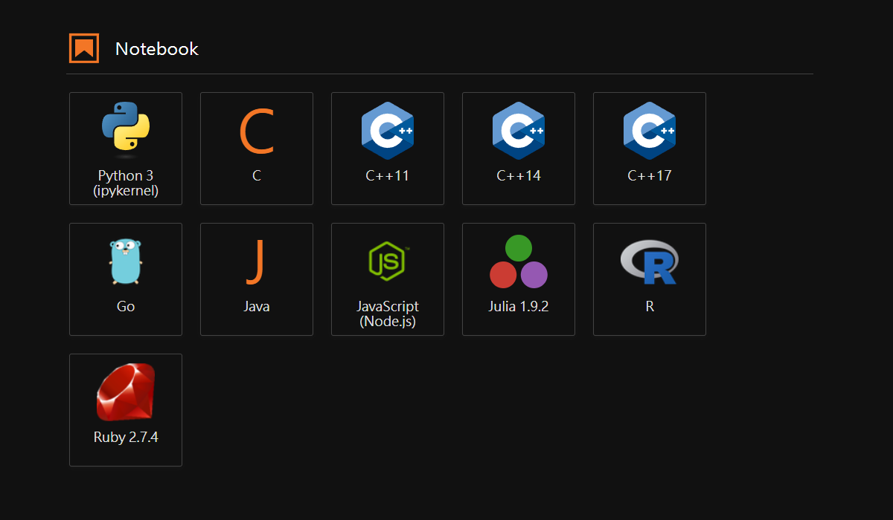

# TraefikLab

This repository provides a Docker environment for running Jupyter Lab/Notebook with the Traefik reverse proxy. It supports multiple languages including Python, C, C++, Golang, Java, Javascript, Julia, R, and Ruby and can easily combined with extra services.


## Kernels in Jupyter Lab




## Prerequisites

- Docker: [https://www.docker.com/](https://www.docker.com/)

- Docker-compose: [https://docs.docker.com/compose/install/](https://docs.docker.com/compose/install/)

- GNU make: [https://www.gnu.org/software/make/manual/make.html](https://www.gnu.org/software/make/manual/make.html)


## Usage

The Makefile commands are listed in the following:

```bash
# Build docker images
make build

# Create docker network
make network

# Start containers (default: Jupyer Lab & Notebook)
make start
```


## After deployment

You can go to [localhost:1001](http://localhost:1001) for the traefik dashboard and [localhost:1002/lab](https://localhost:1002/lab) for the Jupyter Lab UI or [localhost:1002/tree](https://localhost:1002/tree) for the Jupyter Notebook UI.


## Clean up

```bash
# Remove containers
make clean
```


## Authors
[@wyhwong](https://github.com/wyhwong)
